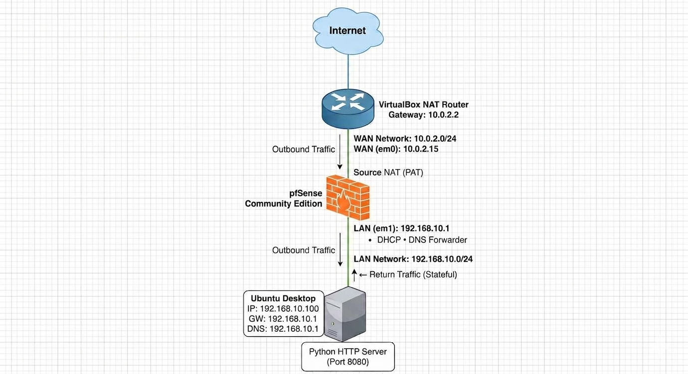

# 🛡️ Enterprise Firewall & Network Security Home Lab using pfSense

<p align="center">
  
  
  
  
  
</p>

> A production-inspired firewall and network security laboratory built using **pfSense Community Edition (v2.7.2-RELEASE)** to demonstrate enterprise firewall administration, Network Address Translation (NAT), routing, defensive packet analysis, boundary vulnerability testing, and stateful inspection.

---

## 📖 Table of Contents

* [Project Overview](#-project-overview)
* [Project Objectives](#-project-objectives)
* [Environment Context](#-environment-context)
* [Architecture](#-architecture)
* [Security Mindset: Boundary Testing & Validation](#-security-mindset-boundary-testing--validation)
* [Features Implemented](#-features-implemented)
* [Documentation Matrix](#-documentation-matrix)
* [Production Strategy vs. Lab Implementations](#-production-strategy-vs-lab-implementations)
* [Reproduction & Quick Start Guide](#-reproduction--quick-start-guide)
* [Skills Demonstrated](#-skills-demonstrated)
* [Future Improvements](#-future-improvements)
* [References](#-references)
* [Author](#-author)

---

## 📌 Project Overview

This project demonstrates the deployment, adversarial configuration validation, and troubleshooting of a pfSense firewall within a virtualized home lab sandbox. 

The lab simulates core enterprise networking concepts including security zone segregation, strict egress filtering, Hybrid Network Address Translation (NAT), and stateful session tracking. 

Rather than simply applying static configuration changes, this project applies a defensive engineering approach—actively testing security boundaries from external zones to verify that the firewall behaves as intended under live adversarial conditions.

---

## 🎯 Project Objectives

* Deploy pfSense in an isolated, multi-interface hypervisor environment.
* Implement a **Default Deny** security postures matching least-privilege models.
* Manage client provisioning via centralized DHCP and secure DNS Unbound engines.
* Code and enforce strict stateful firewall policies and time-based access constraints.
* Validate inbound boundary defenses by probing the perimeter from external networks.
* Document systemic baseline performance, packet alterations, and troubleshooting frameworks.

---

## ⚙️ Environment Context

To ensure testing consistency and audit accuracy, the laboratory was built and verified using the following exact software baselines:
* **Firewall Engine:** pfSense Community Edition `2.7.2-RELEASE` (Built: December 2023)
* **Hypervisor Platform:** Oracle VirtualBox Virtualization Suite
* **Internal Endpoint Client:** Ubuntu Desktop LTS
* **External Security Probing Engine:** Kali Linux Offensive Suite

---

## 🏗 Architecture

<p align="center">
  
</p>

The architecture mimics an enterprise edge deployment model:
* **WAN Segment (`10.0.2.0/24`):** External untrusted network connected to the upstream hypervisor NAT gateway.
* **LAN Subnet (`192.168.10.0/24`):** High-trust, segmented internal asset domain.

---

## ⚔️ Security Mindset: Boundary Testing & Validation

To shift this project from an administrative configuration showcase into an empirical security assessment, the network boundaries were tested from an adversarial perspective using an external testing node.

[ Kali Linux Node ] ──( Unsolicited WAN Scan )──► ╳ [ pfSense WAN Interface ] ──► ( DROPPED BY DEFAULT DENY )

### 1. Inbound External Reconnaissance Probing
An aggressive, unsolicited network port scan was executed from an external testing machine sitting directly on the untrusted WAN backplane segment targeting the public IP of the pfSense interface:
```bash
# Execute a comprehensive TCP Syn stealth scan against the firewall WAN edge
nmap -sS -Pn -p 1-1024 10.0.2.15
```

### 2. Observable Security Results
* **Firewall Action:** Every incoming probe packet targeting ports outside of explicitly defined port forwards (such as Port 8080) was silently dropped.
* **Scan Feedback:** The external reconnaissance tool marked all scanned ports as `filtered` or `closed`.
* **Defensive Proof:** This directly validates the **Default Deny Security Model**. Unsolicited incoming connections from external spaces cannot discover internal topology maps or access internal services without explicit destination mapping authorization.

---

## ✨ Features Implemented

* **Interface Provisioning:** Explicit network boundary driver bindings and layer-3 segmentation.
* **Stateful Access Control Policies:** Granular business-hours restrictions and alias-driven blocks.
* **Dynamic Scoping Daemons:** Active DHCP distribution pools paired with responsive DNS record caching.
* **Hybrid Outbound NAT Mappings:** Controlled source header translation schema for outbound asset privacy.
* **Inbound Destination Port Forwarding:** Encapsulated mapping of external requests down to targeted apps.
* **Concurrent Interface Wire Diagnostics:** Deep frame verification loops capturing pre-and-post NAT snapshots.

---

## 📚 Documentation Matrix

| Module ID | Documentation Title | Repository Navigation |
| :--- | :--- | :--- |
| **01** | Project Overview | [View Document](docs/01-project-overview.md) |
| **02** | Network Topology | [View Document](docs/02-network-topology.md) |
| **03** | Environment Deployment | [View Document](docs/03-environment-deployment.md) |
| **04** | Network Configuration | [View Document](docs/04-network-configuration.md) |
| **05** | Firewall Rules Enforcement | [View Document](docs/05-firewall-rules.md) |
| **06** | Network Address Translation (NAT) | [View Document](docs/06-nat.md) |
| **07** | Packet Analysis and Captures | [View Document](docs/07-packet-analysis.md) |
| **08** | Network Diagnostics and Tables | [View Document](docs/08-network-diagnostics.md) |
| **09** | Troubleshooting Frameworks | [View Document](docs/09-troubleshooting.md) |
| **10** | Lessons Learned & Technical Review | [View Document](docs/10-lessons-learned.md) |

---

## 🏢 Production Strategy vs. Lab Implementations

Operating a firewall safely within a live corporate production ecosystem requires hardening decisions that go beyond the basic requirements of an isolated learning lab. 

The matrix below highlights the architectural changes required to transform this functional proof-of-concept into a production-grade deployment:

| Operational Control | Home Lab Sandbox Implementation | Production Enterprise Standard |
| :--- | :--- | :--- |
| **Administrative Access** | Access allowed over standard HTTP channels during initial provisioning cycles. | **Enforce HTTPS Only.** Force strict TLS 1.3 encryption on the WebGUI and restrict interface listening bindings exclusively to dedicated Out-of-Band (OOB) Management VLANs. |
| **System Credentials** | Standard factory passwords maintained for speed across simple test cycles. | **Rotate Defaults Instantly.** Enforce high-entropy, unique credential values backed by centralized Multi-Factor Authentication (MFA / RADIUS). |
| **Console Access Management** | Password-based interaction allowed over clear SSH terminal sessions. | **Hardened SSH.** Enforce public key-based cryptographic authentication exclusively; disable root password access entirely. |
| **Logging & Telemetry** | Local database storage mapping directly to file traces (`/tmp/*.pcap`). | **Centralized Logging.** Stream system logs using secure syslog forwarders to an enterprise SIEM engine for long-term retention and alert correlation. |
| **Business Continuity** | Single-node deployment instance on a lone hypervisor system. | **High Availability (HA).** Pair multiple physical appliances via Common Address Redundancy Protocol (**CARP**) to support state-synchronized automatic failover. |
| **Configuration Backups** | Manual snapshot creation triggered from the dashboard layout menu. | **Automated Backups.** Schedule regular encrypted backup tasks to an off-site, access-controlled vault repository. |

---

## 🛠 Reproduction & Quick Start Guide

Follow these sequential steps to replicate this exact firewall and client validation environment in your virtualization setup:

### 1. Provision the Network Layout in VirtualBox
* Navigate to VirtualBox Preferences and create a new **NAT Network** named `Lab_WAN` configured with the subnet bounds `10.0.2.0/24`.
* Create a dedicated host-only or isolated internal backplane layout named `Lab_LAN`.

### 2. Configure the pfSense Firewall Virtual Machine
* Create a new VM profile allocating **2 vCPUs, 2GB RAM, and a 20GB Virtual Disk**.
* Mount the downloaded `pfSense-CE-2.7.2-RELEASE-amd64.iso` image to the virtual optical drive.
* Map **Network Adapter 1** to your `Lab_WAN` NAT Network interface.
* Map **Network Adapter 2** to your isolated `Lab_LAN` Internal Network.

### 3. Initialize the Gateway Operating System
* Power on the VM, follow the interactive setup scripts, and install the base OS to the virtual drive.
* Upon reboot, complete interface tracking assignments via the console: allocate interface `em0` as **WAN** and interface `em1` as **LAN**.
* Set the LAN interface IPv4 properties statically: Assign address `192.168.10.1/24` and enable the local DHCP server pool distribution daemon.

### 4. Provision the Ubuntu Endpoint Client
* Create your Linux workstation client VM, setting its single network adapter assignment explicitly to the same `Lab_LAN` Internal Network backplane.
* Boot the OS. The interface will automatically pull an address lease (e.g., `192.168.10.100`) from the pfSense DHCP server.
* Open a terminal window on your Ubuntu workspace node and verify your stateful connectivity path by running:
  ```bash
  ping -c 4 8.8.8.8
  ```

---

## 🧪 Skills Demonstrated

### Core Infrastructure & Routing
* Structured subnet masking planning using modern CIDR formatting guidelines.
* Stateful boundary routing across multi-zone routing engines.
* Centralized configuration mapping spanning DHCP and Unbound caching architectures.

### Network Defense Engineering
* Application of Least Privilege principles across layer-3 access control lists.
* Deployment and tuning of translation configurations (SNAT, PAT, DNAT).
* Interpretation of live state table flag states (`ESTABLISHED:ESTABLISHED`) to trace handshake life cycles.

### Security Analytics & Telemetry
* Wire monitoring using pcap parsing filters to capture and review raw frame headers.
* Reading firewall tracking entries to verify rule IDs and find blocked network traffic patterns.
* System troubleshooting using deep interface ping routines, route tracing, and active log mining.

---

## 🚀 Future Improvements

This pfSense firewall installation forms the structural core network routing and security foundation for a scaling enterprise security home lab. Future lab expansions will build upon this layout using the following roadmaps:

1. **Enterprise VLAN Segmentation:** Add explicit `OPT` virtual interfaces on the pfSense firewall using 802.1Q tags to isolate Active Directory, SIEM, and workstation traffic into distinct broadcast domains.
2. **Active Directory Lab Deployment:** Stand up a Windows Server domain controller cluster behind the LAN gateway to manage centralized domain authentication and enforce baseline security Group Policy Objects (GPOs).
3. **Windows Event Forwarding (WEF) Setup:** Configure group policy subscriptions to automatically pull system, security, and application logs from domain workstations down to a centralized log-collector endpoint.
4. **Sysmon Deployment & Tuning:** Roll out the Microsoft System Monitor (Sysmon) extension across endpoints to collect advanced telemetry, including process creations, network socket origins, and raw memory loading hooks.
5. **Wazuh SIEM Integration:** Deploy a central Wazuh manager node in a dedicated management subnet to ingest endpoint logs and systematically parse data against active threat intelligence metrics.
6. **Detection Engineering Practice:** Author custom Sigma rule sets and SIEM alert logic designed to catch suspicious actions, such as lateral movement attempts or unauthorized external DNS tunneling.
7. **Incident Response & Threat Hunting:** Execute controlled malware simulations within isolated subnets to practice analyzing memory structure artifacts, tracking process execution paths, and conducting live post-breach forensics.

---

## 📖 References

* **Netgate pfSense Technical Documentation:** [Core Reference Guide](https://netgate.com)
* **RFC 1918:** Address Allocation for Private Internets (Subnet Boundaries)
* **RFC 4787:** Network Address Translation (NAT) Behavioral Requirements for Unicast UDP

---

## 👨‍💻 Author

**Harsh Soni**  
[GitHub Profile](https://github.com)  
*Cybersecurity Engineer | Defensive Security Practitioner | Threat Hunting Enthusiast*
