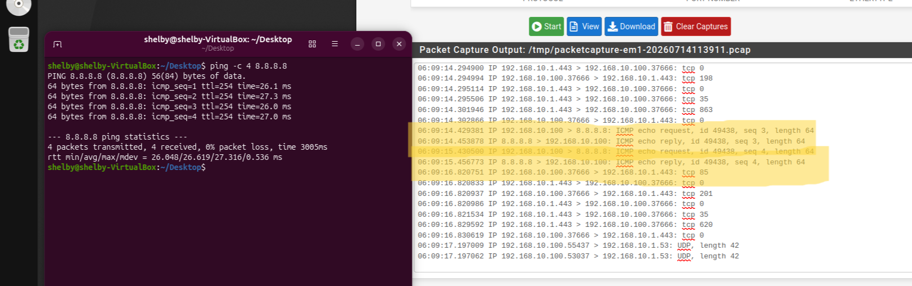
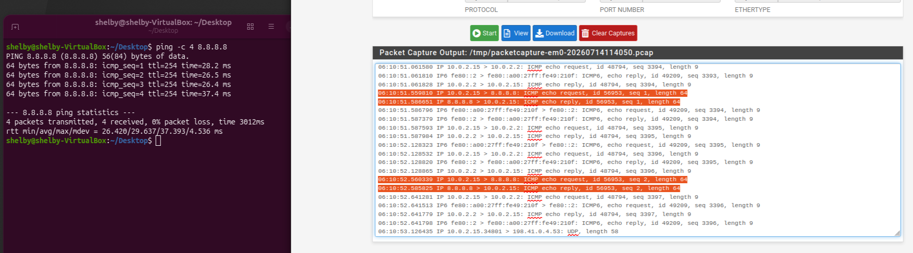
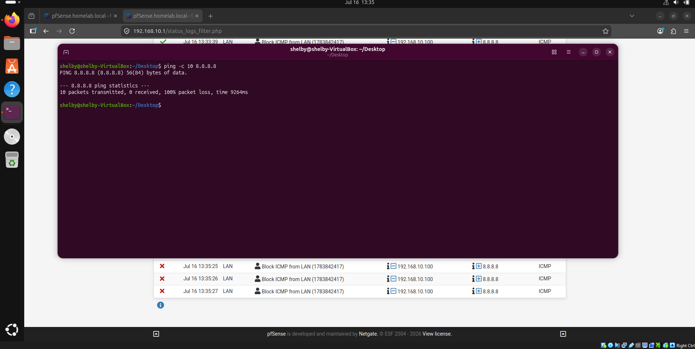

# 🛡️ PfSense Firewall Home Lab

  
  
  
  
  

> A home lab built with pfSense Community Edition (v2.7.2-RELEASE) covering firewall administration, NAT, routing, and rule verification through packet-level testing.

---

## 📖 Table of Contents

* [Project Overview](#-project-overview)
* [Project Objectives](#-project-objectives)
* [Environment Context](#-environment-context)
* [Architecture](#-architecture)
* [Security Mindset: Boundary Testing & Validation](#-security-mindset-boundary-testing--validation)
* [Features Implemented](#-features-implemented)
* [Documentation Matrix](#-documentation-matrix)
* [Production Strategy vs. Lab Implementations](#-production-strategy-vs-lab-implementations)
* [Reproduction & Quick Start Guide](#-reproduction--quick-start-guide)
* [Skills Demonstrated](#-skills-demonstrated)
* [Future Improvements](#-future-improvements)
* [References](#-references)
* [Author](#-author)

---

## 📌 Project Overview

This is a virtualized home lab where I deployed pfSense as a firewall between a simulated WAN and LAN, configured NAT and DHCP, wrote firewall rules, and then tested those rules by generating real traffic and capturing it to confirm the firewall was actually doing what I configured it to do — not just assuming the config was correct.

The lab covers network segmentation, NAT translation, DHCP/DNS, and packet-level verification. Where possible, I've included the actual packet captures and rule states as evidence rather than just describing the setup.

---

## 🎯 Project Objectives

* Deploy pfSense in an isolated, multi-interface virtual environment
* Implement default-deny firewall rules (least privilege)
* Configure DHCP and DNS (Unbound) for LAN clients
* Write and enforce stateful firewall rules, including time-based restrictions
* Verify NAT and firewall rule behavior using packet captures rather than trusting the configuration alone
* Document the setup, configuration, and troubleshooting steps

---

## ⚙️ Environment

* **Firewall:** pfSense Community Edition 2.7.2-RELEASE
* **Hypervisor:** Oracle VirtualBox
* **LAN client:** Ubuntu Desktop 26.04 LTS

---

## 🏗 Architecture

  

This lab uses a two-interface setup:
* **WAN Segment (`10.0.2.0/24`):** Simulated external network, connected through the hypervisor's NAT gateway.
* **LAN Segment (`192.168.10.0/24`):** Internal network where the client sits, behind the firewall.

---

## ⚔️ Security Mindset: Boundary Testing & Validation

Configuring firewall rules is easy to get wrong silently — a rule can look correct and still not do what you expect. To catch that, I tested the rules instead of just trusting them.

NAT verification: I ran ping -c 4 8.8.8.8 from the LAN client and captured traffic on both sides of the firewall. The LAN-side capture shows the client's real internal IP (192.168.10.100); the WAN-side capture shows the same traffic translated to the firewall's external address (10.0.2.15). This confirms NAT is actually rewriting source addresses as configured — 

Rule enforcement verification: After confirming the "Block ICMP from LAN" rule was in place, I tested it by pinging 8.8.8.8 from the LAN client (192.168.10.100) — 10 packets sent, 0 received, 100% loss. The pfSense firewall log for the same window shows matching blocked entries for the identical source/destination/protocol. 
This confirms the rule is actively enforced, not just configured — 

---

## Features Implemented

- **Interface & subnet segmentation** — separate WAN and LAN interfaces with distinct IP ranges
- **Firewall rules** — explicit allow/deny rules including time-based restrictions (e.g., SSH blocked during business hours), verified against real traffic
- **DHCP + DNS** — DHCP server issuing LAN leases, DNS resolution via Unbound
- **NAT** — outbound NAT translating LAN traffic to the WAN address, confirmed via matched packet captures on both interfaces
- **Port forwarding** — inbound rule mapping external requests to an internal service
- **Packet capture verification** — used pfSense's built-in packet capture to confirm rule behavior at the packet level rather than relying on the rule list alone

---

## 📚 Documentation Matrix

| Module ID | Documentation Title | Repository Navigation |
| :--- | :--- | :--- |
| **01** | Project Overview | [View Document](docs/01-project-overview.md) |
| **02** | Network Topology | [View Document](docs/02-network-topology.md) |
| **03** | Environment Deployment | [View Document](docs/03-environment-deployment.md) |
| **04** | Network Configuration | [View Document](docs/04-network-configuration.md) |
| **05** | Firewall Rules Enforcement | [View Document](docs/05-firewall-rules.md) |
| **06** | Network Address Translation (NAT) | [View Document](docs/06-nat.md) |
| **07** | Packet Analysis and Captures | [View Document](docs/07-packet-analysis.md) |
| **08** | Network Diagnostics and Tables | [View Document](docs/08-network-diagnostics.md) |
| **09** | Troubleshooting Frameworks | [View Document](docs/09-troubleshooting.md) |
| **10** | Lessons Learned & Technical Review | [View Document](docs/10-lessons-learned.md) |

---

## Home Lab vs. Production

A home lab and a production firewall have different constraints. Below is what I'd change if this setup needed to run in a real environment, and why.

| Area | This Lab | In Production |
|---|---|---|
| Admin access | WebGUI reachable over plain HTTP during setup | HTTPS only, TLS enforced, management interface restricted to a dedicated out-of-band network |
| Credentials | Default passwords, changed manually | Unique high-entropy credentials, MFA via RADIUS |
| SSH access | Password-based login | Key-based auth only, root login disabled |
| Logging | Captures saved locally as `.pcap` files | Logs forwarded to a central SIEM for retention and correlation |
| Availability | Single firewall instance | Two firewalls in an HA pair (CARP) for failover |
| Backups | Manual config export from the dashboard | Scheduled, encrypted, stored off-site |

---

## Reproduction Guide

1. **Network setup (VirtualBox):** Create a NAT network `Lab_WAN` (10.0.2.0/24) and an internal network `Lab_LAN`.
2. **pfSense VM:** 2 vCPU, 2GB RAM, 20GB disk. Mount `pfSense-CE-2.7.2-RELEASE-amd64.iso`. Adapter 1 → `Lab_WAN`, Adapter 2 → `Lab_LAN`.
3. **Install pfSense:** Assign `em0` as WAN, `em1` as LAN. Set LAN to `192.168.10.1/24`, enable DHCP.
4. **LAN client:** Attach to `Lab_LAN`, boot, confirm it gets a DHCP lease (e.g. `192.168.10.100`).

Verify connectivity: `ping -c 4 8.8.8.8`

---

## Skills Demonstrated

- Firewall rule design (least-privilege, default-deny)
- NAT configuration and verification (source/destination translation)
- DHCP/DNS service configuration
- Packet capture and traffic analysis to validate firewall behavior, not just configuration
- Reading pfSense state tables and logs to confirm rules are actively enforced

## Future Improvements

- VLAN segmentation for AD, SIEM, and workstation traffic
- Active Directory domain controller behind the LAN gateway
- Windows Event Forwarding to a central log collector
- Sysmon deployment across endpoints
- Wazuh SIEM integration for centralized detection
- Custom Sigma rules for lateral movement / DNS tunneling detection
- Controlled malware simulation for incident response practice

## References

- [Netgate pfSense Documentation](https://docs.netgate.com/pfsense/en/latest/)
- [RFC 1918 – Private Address Allocation](https://www.rfc-editor.org/rfc/rfc1918)
- [RFC 4787 – NAT Behavioral Requirements](https://www.rfc-editor.org/rfc/rfc4787)

## Author

**Harsh Soni**
[GitHub](https://github.com/harshhhhh10)
