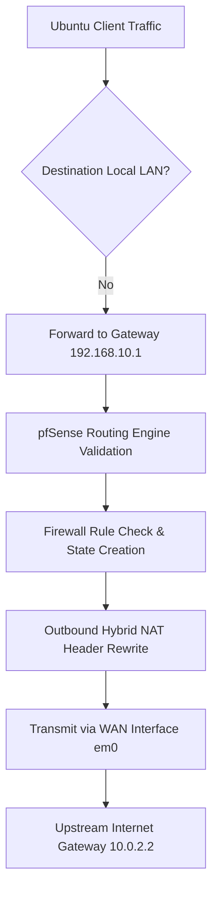

# Network Configuration

## Objective

This document describes the Layer 3 network architecture implemented within the pfSense home lab. It details interface addressing, gateway assignment, dynamic client configuration via DHCP, optimized internal DNS resolution, and structural path validation.

The objective was to establish reliable communication between internal LAN subnets and external boundaries while ensuring all outbound traffic traverses the pfSense stateful engine.

---

## Network Overview

The lab consists of two isolated Layer 3 broadcast domains routed exclusively through the pfSense firewall:

| Interface | Network Subnet | Network Role / Purpose |
| :--- | :--- | :--- |
| **WAN** | `10.0.2.0/24` | External Untrusted Network (VirtualBox NAT Network) |
| **LAN** | `192.168.10.0/24` | Internal Trusted Private Subnet |

---

## WAN Configuration

| System Property | Configured Value |
| :--- | :--- |
| **Physical Interface** | `em0` |
| **IPv4 Assignment** | `10.0.2.15/24` |
| **Upstream Gateway IP** | `10.0.2.2` |
| **Network Bounds** | `10.0.2.0/24` |

### Interface Purpose
The WAN interface serves as the firewall's exit node to the VirtualBox hypervisor NAT router. This setup provisions simulated public internet access. The explicit default gateway (`10.0.2.2`) routes any non-local destination headers upward to external recursive networks.

---

## LAN Configuration

| System Property | Configured Value |
| :--- | :--- |
| **Physical Interface** | `em1` |
| **IPv4 Assignment** | `10.0.2.1` / `192.168.10.1/24` |
| **Network Bounds** | `192.168.10.0/24` |

### Interface Purpose
The LAN interface acts as the localized default gateway for all host nodes inside the internal network. Every bit of packet traffic generated by trusted clients must hit this interface first to complete policy filtering before routing outward.

---

## DHCP Configuration

The Dynamic Host Configuration Protocol (DHCP) daemon is enabled natively on the LAN interface to automate client provisioning.

The server distributes the following parameters dynamically:
* Unique IPv4 address leases within a controlled pool
* Subnet Mask properties (`255.255.255.0`)
* Default Gateway address pointing back to `192.168.10.1`
* Primary and secondary domain name server destinations

> [!TIP]
> Automating address distribution via a centralized DHCP pool removes individual host entry management. It systematically avoids IP conflict states across lab test cycles.

---

## DNS Architecture (Resolver vs. Forwarder)

As validated in the `Services / DNS Resolver` system panel, the firewall executes the modern **Unbound DNS Resolver** service rather than the legacy `dnsmasq` DNS Forwarder. 

[ Internal Clients ] ──( Query: 192.168.10.1 )──► [ Unbound DNS Resolver ] ──( Forward Mode )──► [ Upstream DNS: 1.1.1.1 / 8.8.8.8 ]

### Active Configuration Parameters

| Parameter | Implemented Value | System Mechanics |
| :--- | :--- | :--- |
| **Active Service** | `Unbound Resolver` | Modern secure caching resolver engine |
| **Forwarding Mode** | :white_check_mark: Enabled | Instructs Unbound to query designated upstream servers |
| **DNSSEC Validation** | :white_check_mark: Enabled | Cryptographically verifies authenticity of DNS answers |
| **Listening Interface** | `LAN` | Listens for client resolution requests locally |
| **Upstream Targets** | `1.1.1.1` (Cloudflare) / `8.8.8.8` (Google) | Handles non-cached query execution requests |

### Why This Hybrid Architecture Mode Is Used
pfSense offers two separate components for hostname management. The lab configuration leverages the best features of both designs:

* **DNS Resolver (Unbound):** Standard native option. It provides localized memory caching, structural DNSSEC chain authentication, and advanced privacy filtering controls.
* **DNS Forwarder (dnsmasq):** A legacy, lightweight utility that forwards queries without validation capabilities. Left disabled inside this deployment.

> [!NOTE]
> Running the **DNS Resolver with Forwarding Mode Enabled** combines the caching and cryptographic verification benefits of Unbound with the speed and reliability of trusted upstream infrastructure.

---

## Routing & Packet Lifecycle

The Ubuntu Server utilizes `192.168.10.1` as its singular default gateway path. If a requested header destination sits outside the internal `/24` subnet boundaries, it routes systematically along this path:

---

## Validation & Verification Metrics

System execution was explicitly verified on the live wire using terminal debugging commands:

- [x] **Dynamic Lease Checks:** Confirmed client machines pull valid IP addresses from the firewall's DHCP pool.
- [x] **Gateway Ping Probes:** Verified layer 2/3 adjacency by executing `ping 192.168.10.1`.
- [x] **External Path Probes:** Verified outbound state creation by executing `ping 8.8.8.8`.
- [x] **Name Resolution Tests:** Verified full functionality by executing `nslookup google.com` directly from internal client terminals.

---

## Design Decisions

* **Why run pfSense for DNS?** Using the local firewall node centralizes internal tracking analytics. It prevents local endpoints from making independent connections to random public nameservers.
* **Why split subnets statically?** Isolating external WAN translation boundaries from private LAN segments establishes a realistic sandbox framework. This layout is perfect for practicing stateful firewall rule filtering and address mapping controls.

---

## Screenshots Required

The following assets provide cryptographic validation proof for the deployment report:

* `04-network/01-wan-config.png` — WAN configuration menu layout
* `04-network/02-lan-config.png` — LAN interface addressing schema
* `04-network/03-dhcp-server.png` — Active DHCP settings and client assignment pool
* `04-network/04-dns-resolver.png` — Unbound active configuration with Forwarding checked
* `05-validation/01-ping-tests.png` — Terminal proofs showing active domain resolution captures
