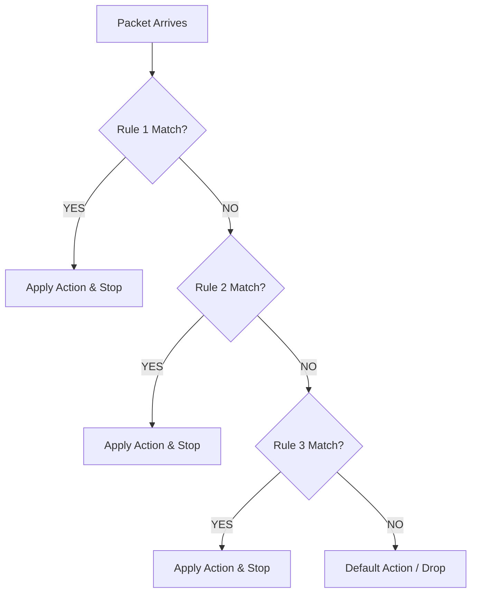

# Firewall Rules

## Objective

This document explains how firewall rules were implemented and validated within the pfSense home lab.

The primary objective was to understand how pfSense evaluates traffic, applies security policies, creates state entries, and permits or blocks network communication based on the principle of least privilege.

---

## Firewall Philosophy

pfSense follows a **default deny** security model.

* Traffic is **denied unless an explicit firewall rule allows it**
* This approach follows the **principle of least privilege** by permitting only the traffic that is required

> [!IMPORTANT]
> The **Anti-Lockout Rule** is an exception to this model. It actively prevents administrators from being locked out of the web interface.

---

## Rule Evaluation Order

Firewall rules are processed from the **top of the list to the bottom**.

The first rule that matches a packet is immediately applied. Subsequent rules are not evaluated.

Because of this **first-match behavior**, rule order is critical.

---

### Implemented LAN Rules

| Rule Order | Action | Protocol | Source | Destination | Destination Port | Description |
| :--- | :--- | :--- | :--- | :--- | :--- | :--- |
| **1** | 🟢 Pass | IPv4 TCP | LAN net | LAN Address | 443 / 80 | pfSense Anti-Lockout Rule |
| **2** | 🔴 Block | IPv4 ICMP | LAN net | LAN Address | * | Block ICMP from LAN |
| **3** | 🔴 Block | IPv4 TCP | LAN net | * | 80 (HTTP) | Block HTTP from LAN |
| **4** | 🔴 Block | IPv4 * | LAN net | `google_DNS` (Alias) | * | Block Google DNS Alias |
| **5** | 🔴 Block | IPv4 TCP | LAN net | * | 22 (SSH) | Block SSH during Business Hours |
| **6** | 🟢 Pass | IPv4 * | LAN net | * | * | Default allow LAN to any rule |
| **7** | 🟢 Pass | IPv6 * | LAN net | * | * | Default allow LAN IPv6 to any rule |

### Rule-by-Rule Explanation

#### 1. Anti-Lockout Rule
* **Purpose:** Prevents accidental lockout from the pfSense web interface.
* **Why it's needed:** If a misconfigured rule blocks access to the firewall itself, this rule ensures administrative access is preserved.
* **Action:** Pass TCP traffic from LAN to the firewall on ports 443 (HTTPS) and 80 (HTTP).

#### 2. Block ICMP from LAN
* **Purpose:** Restricts ICMP echo requests originating from internal hosts.
* **Security Rationale:** While ICMP is useful for diagnostics, unrestricted ICMP can be used for reconnaissance (ping sweeps) or certain ICMP-based attacks.

> [!NOTE]
> This rule blocks outbound ICMP from LAN. Inbound ICMP to LAN is already blocked by default deny on WAN.

#### 3. Block Google DNS Alias
* **Purpose:** Forces internal clients to use the pfSense DNS Resolver instead of bypassing to external DNS servers.
* **Security Rationale:** 
  * Ensures DNS queries are logged and filtered by the firewall.
  * Prevents DNS tunneling attempts that bypass security controls.
  * Maintains centralized visibility into DNS activity.
* **Implementation:** An alias `Google_DNS` was created containing known Google DNS IP addresses (`8.8.8.8`, `8.8.4.4`).

#### 4. Block SSH During Business Hours
* **Purpose:** Restricts SSH outbound access during business hours (08:00–18:00, Monday–Friday).
* **Security Rationale:** 
  * Limits lateral movement opportunities during peak hours.
  * Encourages use of secure remote access methods (VPN) instead of direct SSH.
  * Reduces attack surface during periods when monitoring is most active.
* **Schedule:** Applied using pfSense schedule feature for time-based enforcement.

#### 5. Allow LAN to Any
* **Purpose:** Permits all outbound traffic from trusted internal hosts.
* **Security Rationale:** 
  * Internal hosts are trusted to initiate connections.
  * Return traffic is handled automatically by Stateful Packet Inspection (SPI).
  * This is the primary rule enabling Internet connectivity for LAN devices.

#### 6. Default Allow LAN IPv6
* **Purpose:** Permits IPv6 traffic from internal hosts.
* **Note:** While the lab primarily uses IPv4, this rule ensures IPv6 functionality is not inadvertently broken.

---

## WAN Rules

The **WAN interface** follows the default deny model with no explicit allow rules for unsolicited inbound traffic.

| Rule | Action | Protocol | Source | Destination | Purpose |
| :--- | :--- | :--- | :--- | :--- | :--- |
| Default Deny | `Block` | Any | Any | Any | Reject all unsolicited inbound connections |

### Why No WAN Allow Rules?

* External hosts should **not** initiate connections to internal systems.
* Legitimate return traffic is automatically permitted by **Stateful Packet Inspection (SPI)**.
* Port Forwarding (Destination NAT) is used for specific external access requirements (documented in [06-nat.md](06-nat.md)).

---

## Stateful Packet Inspection (SPI)

pfSense is a **stateful firewall**.

When an internal host initiates a connection:
1. Firewall rule is evaluated (must match an allow rule).
2. State entry is created in the state table.
3. Reply traffic is **automatically permitted** (no additional inbound rule needed).
4. State is removed after the session expires or is closed.

This means:
* :white_check_mark: Outbound connections from LAN are permitted by `Allow LAN to Any`.
* :white_check_mark: Return traffic is automatically allowed by SPI.
* :x: Unsolicited inbound connections from WAN are blocked by default deny.

---

## Rule Verification

Each firewall rule was validated using one or more methods:

| Verification Method | What It Confirmed |
| :--- | :--- |
| Firewall Logs | Rule ID, source/destination IP, protocol, action (Pass/Block) |
| Packet Capture | Traffic matched intended rule and interface |
| State Table | SPI created state entries for allowed connections |
| Ping / curl | Connectivity worked for allowed protocols |
| Blocked HTTP Test | HTTP traffic was blocked as expected |

### Verification Example: Block ICMP Rule

* **Test:** `ping 8.8.8.8` from Ubuntu Desktop
* **Expected Result:** Packets blocked by Rule 2
* **Evidence:** Firewall logs showed ICMP packets from `192.168.10.100` to `8.8.8.8` with action **Block**

---

## Design Decisions

* **Why block ICMP from LAN?** ICMP is useful for diagnostics but can be abused for network reconnaissance. Blocking outbound ICMP forces use of approved diagnostic tools and reduces information leakage.
* **Why block Google DNS?** Forcing DNS through the pfSense Resolver ensures DNS queries are visible in firewall logs, filtering/security policies are enforced, and DNS tunneling attempts are prevented.
* **Why time-based SSH blocking?** Time-based rules demonstrate understanding of **context-aware security policies** — different restrictions apply at different times based on risk assessment.
* **Why allow LAN before any WAN rules?** Internal hosts are trusted to initiate outbound connections. External hosts are untrusted and should never initiate unsolicited inbound connections.

> [!TIP]
> **Why verify using logs?** Configuration alone does not prove that a rule is functioning correctly. Firewall logs provide unambiguous **evidence** that traffic matched the expected rule with the intended action.

---

## Screenshots

The following screenshots document the firewall rule configuration:

| Screenshot | Description | File |
| :--- | :--- | :--- |
| LAN Firewall Rules | Complete LAN rule list showing all 6 rules | `03-firewall/01-lan-rules.png` |
| WAN Firewall Rules | WAN interface default deny policy | `03-firewall/02-wan-rules.png` |
| Firewall Log (Blocked ICMP) | Evidence of ICMP block rule enforcement | `06-firewall-logs/01-icmp-blocked.png` |

---

## Key Takeaways

This phase successfully demonstrated several core firewall concepts:

- [x] **Default Deny Security:** Confirmed that only explicitly permitted traffic traverses interfaces.
- [x] **Stateful Operation:** Verified that return traffic bypasses explicit evaluation once a valid session state is active.
- [x] **First-Match Execution:** Configured explicit blocks higher in the stack than wide allow statements.
