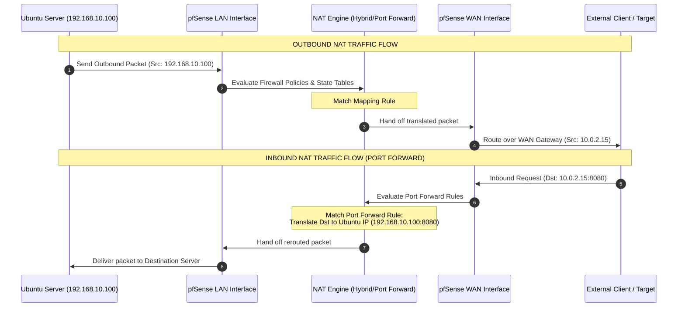

# Network Address Translation (NAT)

## Objective

This document explains how Network Address Translation (NAT) was configured, optimized, and verified within the pfSense firewall home lab.

The primary objective was to understand how pfSense translates private IP addresses into routable addresses, how outbound NAT modes manipulate packets, and how to securely expose internal services using destination port forwarding.

---

## What is NAT & Why It Is Required

Network Address Translation (NAT) modifies IP header addresses as packets pass through the firewall. Private IPv4 addresses (RFC 1918) are non-routable across the public Internet; upstream routers drop them immediately to prevent routing chaos. 

Without NAT, external hosts cannot return traffic because they lack a path back to internal subnets. NAT allows internal systems to communicate externally by utilizing the firewall's single public WAN address.

[ Internal Subnet ] ──( Private IP )──► [ pfSense Firewall ] ──( Public WAN IP )──► [ External Internet ]

---

## NAT Modes in pfSense

pfSense provides distinct modes for handling outbound translation depending on the scale and complexity of the environment:

* **Automatic Outbound NAT:** Automatically generates translation rules for connected interfaces. Ideal for simple setups but lacks customization.
* **Hybrid Outbound NAT:** Combines automatically generated system rules with manually defined overrides at the top of the stack. **(Selected Mode for this Lab)**
* **Manual Outbound NAT:** Disables automatic rules entirely. Gives administrators absolute control over every translation rule; standard in enterprise networks with rigid compliance guidelines.

---

## Outbound Mappings Layout

Outbound rules process from **top to bottom**. The first rule that matches a packet executes immediately, bypassing all subsequent rules.

The lab utilizes a **Hybrid Outbound NAT** layout consisting of five precise custom mappings before passing down to automatic rules:

| # | Interface | Source | Destination | NAT Address | Static Port | Description |
| :--- | :--- | :--- | :--- | :--- | :--- | :--- |
| 1 | WAN | `Ubuntu_Server` (Alias) | `*` | WAN address | :x: | Manual NAT using Alias |
| 2 | WAN | `192.168.10.100/32` | `*` | WAN address | :x: | Manual NAT for Ubuntu Only |
| 3 | WAN | `LAN subnets` | `*` | NO NAT | :x: | Outbound NAT Exemption Demo |
| 4 | WAN | `LAN subnets` | `*` | WAN address | :white_check_mark: | Static Port Demo |
| 5 | WAN | `LAN subnets` | `*` | WAN address | :x: | Manual NAT for LAN |

> [!NOTE]
> Setting "Static Port" to enabled (:white_check_mark:) instructs pfSense to preserve the original source port of the client machine during translation instead of randomizing it. This is highly helpful for protocols sensitive to port shifts, such as IPsec VPNs and gaming consoles.

---

## Port Forwarding (Destination NAT)

While Outbound NAT translates internal requests heading outside, **Destination NAT (DNAT) / Port Forwarding** maps unsolicited inbound connections from the external WAN interface to an internal host.

### Port Forwarding Rule Configuration
As verified in the `Firewall / NAT / Port Forward` system panel, an inbound rule allows external access to internal web hosting services:

| Interface | Protocol | Source Address | Source Ports | Dest. Address | Dest. Ports | NAT IP | NAT Ports | Description |
| :--- | :--- | :--- | :--- | :--- | :--- | :--- | :--- | :--- |
| WAN | TCP | `*` | `*` | WAN address | `8080` | `192.168.10.100` | `8080` | Forward HTTP to Ubuntu |

### Engineering Architecture & Port Choice
* **Why Port 8080 instead of 80?** Using port 8080 avoids binding conflicts with the local pfSense administrator WebGUI engine (which defaults to standard HTTP/HTTPS channels). It also adds an elemental layer of security obfuscation against basic Automated Port Scanners searching the public WAN IP for standard web servers.
* **Validation Methodology:** This rule was verified by utilizing a secondary machine sitting outside the WAN network interface boundary. Running a command like `curl http://10.0.2.15:8080` successfully routed traffic through the WAN port, dropped down to the internal destination host, and pulled the server default landing index page.

> [!WARNING]
> **Security Implications:** Exposing internal infrastructure services directly via Port Forwarding opens vulnerabilities. Unpatched service exploits on the Ubuntu Server can yield full system access to bad actors. 
> To minimize risk, secure configurations should use context-aware firewall rules limiting source traffic to specific authorized external IPs, or enforce connection exclusively via an encrypted VPN tunnel.

---

## Packet Capture Verification

Address translation mechanics were structurally verified using multi-interface packet captures.

### 1. LAN Interface Capture (Pre-NAT)
When initiating an outbound request to Google DNS (`8.8.8.8`), the packet leaves the local network completely untranslated:

| Field | Captured Value |
| :--- | :--- |
| **Source IP** | `192.168.10.100` |
| **Destination IP** | `8.8.8.8` |

### 2. WAN Interface Capture (Post-NAT)
Once evaluated against the Hybrid Outbound translation rule, the outbound tracking log records an updated packet header context:

| Field | Captured Value |
| :--- | :--- |
| **Source IP** | `10.0.2.15` (pfSense WAN Address) |
| **Destination IP** | `8.8.8.8` |

> [!TIP]
> **Why verify on both interfaces?** Running concurrent captures validates the active operation of the translation engine. Checking only configuration windows proves *intent*, whereas checking the live state table and wire headers provides undeniable cryptographic *evidence*.

---

## Complete Packet Flow Architecture

---

## Screenshots

The following image logs confirm system validation:

| Target Object | Description | Lab File Path |
| :--- | :--- | :--- |
| **Outbound NAT Layout** | Complete Hybrid Outbound strategy showing mappings stack | `04-nat/01-outbound-mappings.png` |
| **Port Forwarding Rule** | Destination NAT config passing WAN port 8080 to LAN | `04-nat/02-port-forward-rule.png` |
| **LAN Wire Verification** | Untranslated trace showing local source host | `05-captures/01-lan-raw.png` |
| **WAN Wire Verification** | Translated trace demonstrating functional SNAT/PAT | `05-captures/02-wan-translated.png` |

---

## Key Takeaways

- [x] **Private vs. Public Addressing Space:** Mastered mapping non-routable RFC 1918 space to active upstream paths.
- [x] **Stateful Destination Mapping:** Configured inbound port forwarding rules to securely handle external requests.
- [x] **Granular Port Selection:** Separated production application ports (8080) from system administrative channels (80) to maintain security policies.
- [x] **Verification Lifecycle:** Implemented explicit packet captures across internal and external boundaries to diagnose exact header rewrites.
