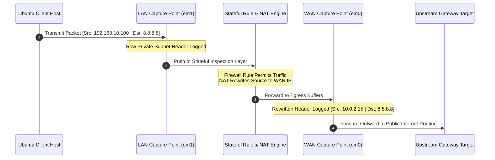

# Packet Analysis

## Objective

This document explains how packet capture mechanics were deployed to observe, track, and verify network traffic traversal within the pfSense home lab environment.

Rather than relying solely on configuration panels, packet analysis provided direct, immutable wire-evidence of how traffic traversed interface boundaries, how Network Address Translation (NAT) rewrote headers, and how core network protocols operated.

---

## Why Packet Capture Is Necessary

Packet capture shifts network administration from assumption to objective observation. It systematically answers critical stateful pipeline questions:
* Is the packet successfully reaching the physical interface?
* Which protocol flags are actively set in the header?
* Was the source header rewritten correctly by the NAT translation engine?
* Is traffic egressing via the appropriate physical network interface?
* Is the stateful filter rule blocking or permitting the connection?

---

## Packet Capture Configuration

Captures were collected concurrently using the integrated pfSense Diagnostic Packet Capture utility (`Diagnostics > Packet Capture`).

| Setting Property | Configuration Mapping |
| :--- | :--- |
| **Capture Interface Targets** | `LAN` (em1) and `WAN` (em0) |
| **Monitored Protocols** | ICMP, TCP, UDP |
| **Traffic Generators** | `ping`, `curl`, and `nslookup` utilities |
| **Analysis Objective** | Direct comparison of pre-translation vs. post-translation headers |

---

## Technical Trace Analysis

### 1. ICMP Traffic Verification (Ping Diagnostics)
To test outbound layer-3 echo reachability, a probe loop was initiated from the Ubuntu desktop client terminal:

```bash
ping -c 4 8.8.8.8
```

#### Client Interface Observation (Pre-NAT)
On the local LAN segment, the capture verifies that the client targets the external server utilizing its native RFC 1918 private IP address:
* **Source Address:** `192.168.10.100`
* **Destination Address:** `8.8.8.8`

#### WAN Interface Output Log Breakdown (Post-NAT)
As highlighted in the live pfSense diagnostic dump (`packetcapture-em0.pcap`), the firewall modifies the outbound header using **Source NAT (SNAT)** before pushing it out to the internet gateway.

> [!NOTE]  
> **Live Log Extraction Summary (`em0` WAN Trace):**
> * `06:10:51.559810` ── **Outbound Request:** `10.0.2.15 > 8.8.8.8`: ICMP echo request, seq 1, length 64
> * `06:10:51.586661` ── **Inbound Response:** `8.8.8.8 > 10.0.2.15`: ICMP echo reply, seq 1, length 64
> * `06:10:52.580939` ── **Outbound Request:** `10.0.2.15 > 8.8.8.8`: ICMP echo request, seq 2, length 64
> * `06:10:52.585825` ── **Inbound Response:** `8.8.8.8 > 10.0.2.15`: ICMP echo reply, seq 2, length 64
>
> **What this trace proves:** The firewall's Hybrid Outbound NAT successfully caught the internal packet from `192.168.10.100`, rewrote the source to the WAN interface IP (`10.0.2.15`), and mapped the returning external replies back to the host via its state table.

---

### 2. DNS Infrastructure Analysis
Name resolution queries were checked by verifying downstream address requests:

```bash
nslookup google.com
```

#### Wire Log Observations
* **Protocol & Port:** UDP Destination Port `53`
* **Flow Vector:** Packets directed straight to the LAN Gateway IP (`192.168.10.1`)
* **Resolution Proof:** Successful response headers returned corresponding public IP mappings, validating the active operation of the local **Unbound DNS Resolver**.

---

### 3. HTTP Cleartext Rules Analysis
To confirm structural policy enforcement of block rules, a cleartext web payload command was executed:

```bash
curl http://example.com
```

#### Wire Log Observations
* **Protocol & Port:** TCP Destination Port `80`
* **Rule Enforcement Verification:** When the time-based or explicit HTTP restriction policy was toggled to active, the trace captured incoming `TCP [SYN]` packets from the host being dropped instantly without receiving `[SYN-ACK]` responses, causing a immediate client-side timeout drop.

---

### 4. HTTPS Secured Analysis
To verify standard outbound encrypted pipelines, secure web commands were executed:

```bash
curl https://example.com
```

#### Wire Log Observations
* **Protocol & Port:** TCP Destination Port `443`
* **Flow Vector:** The capture recorded flawless TCP 3-way handshakes (`SYN` ──► `SYN-ACK` ──► `ACK`), followed immediately by encrypted TLS Application Data exchange payloads.

---

## Structural Header Transformation Map

The specific delta mapping between interface capture points highlights the isolation maintained by the translation engine:

### Before NAT Evaluation (LAN Interface `em1`)

| Packet Header Field | Wire Value Details |
| :--- | :--- |
| **Source IP Address** | `192.168.10.100` (Private Client Node) |
| **Destination IP Address** | `8.8.8.8` (Public DNS Authority) |

### After NAT Evaluation (WAN Interface `em0`)

| Packet Header Field | Wire Value Details |
| :--- | :--- |
| **Source IP Address** | `10.0.2.15` (Rewritten Firewall WAN IP) |
| **Destination IP Address** | `8.8.8.8` (Maintained Target Node Address) |

> [!IMPORTANT]  
> Notice that **only the source address** is altered during Outbound NAT operations. The packet's destination remains untouched throughout the firewall traversal process.

---

## Comprehensive Packet Flow Lifecycle



---

## Validation Screenshots Inventory

The tracking metrics are mapped out in the following interface capture segments:

| Targeted Phase Log | Verification Artifact Description | Document File Path Reference |
| :--- | :--- | :--- |
| **Terminal Test Execution** | Raw Ubuntu bash logs showing successful icmp metrics | `screenshots/05-packet-capture/01-lan-icmp-before-nat.png` |
| **LAN Raw Wire State** | Capture dump verifying untranslated local network headers | `screenshots/05-packet-capture/01-lan-icmp-before-nat.png` |
| **WAN Translated State** | Active pfSense `.pcap` extract showing functional SNAT | `screenshots/05-packet-capture/02-wan-icmp-after-nat.png` |
| **DNS UDP Port 53 Log** | Diagnostic verification of target Unbound name queries | `screenshots/02-services/02-dns-resolver.png` |

---

## Key Takeaways

- [x] **Configuration Validation:** Shifted lab metrics from theoretical policy setup to verifiable raw-wire mechanics.
- [x] **NAT Rewrite Verification:** Cryptographically tracked the exact millisecond timestamps where header source fields switch from RFC 1918 addresses to internet-routable WAN addresses.
- [x] **Policy Enforcement Diagnostics:** Observed how active firewall rules drop network connections on the wire by monitoring failed TCP connection loops.
- [x] **Stateful Session Management:** Confirmed that return traffic flows safely back inward through the WAN without explicit incoming rules, validating the active state synchronization engine.
