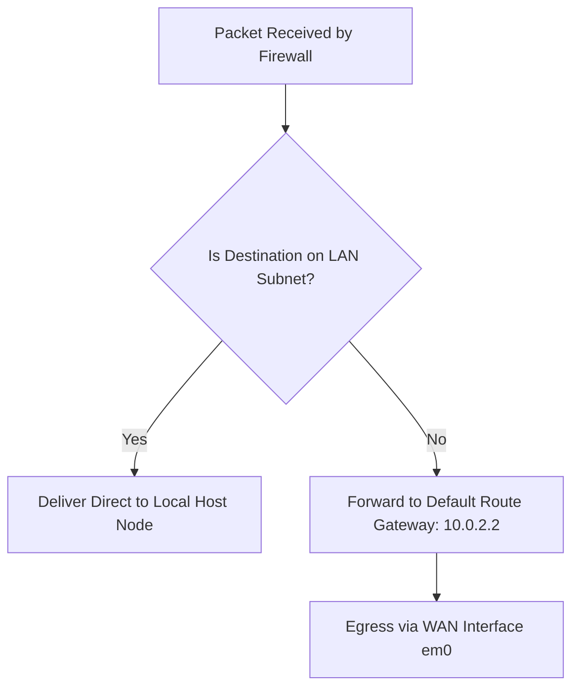

# Network Diagnostics

## Objective

This document explains the suite of diagnostic utilities deployed within the pfSense home lab to validate system-level layer-3 network connectivity, hop-by-hop forwarding paths, and hostname translation.

Rather than assuming the firewall was routing packets accurately based on configuration policies alone, each system component was structurally stress-tested using built-in diagnostic engines to extract observable, verifiable metrics.

---

## Why Network Diagnostics Matter

Network diagnostics shift systems administration from a state of passive assumption to objective engineering. These utilities help isolate faults by answering:
* Are host nodes achieving successful physical and logical adjacency?
* Is name resolution accurately mapping upstream parameters?
* Which exact path and hop routers do packets traverse to exit the boundary?
* At which specific point in the transit layer does communication break down?

---

## Diagnostic Utility Breakdown

### 1. ICMP Ping Utility
The Ping utility verifies end-to-end Layer 3 connectivity between network nodes using Internet Control Message Protocol (ICMP) Echo Requests and Echo Replies.

#### Lab Verification & Observations
Two explicit test profiles were executed via the pfSense dashboard panel (`Diagnostics > Ping`):

1. **Targeting Raw IP Address (`8.8.8.8`):** 
   * **Result:** 3 packets transmitted, 3 packets received, **0.0% packet loss**.
   * **Verification Value:** Proves that the pfSense WAN interface has fully functional IP routing out to the external internet gateway.
2. **Targeting Host Name Domain (`google.com`):**
   * **Result:** 3 packets transmitted, 3 packets received, **0.0% packet loss**.
   * **Verification Value:** Confirmed that the Unbound DNS Resolver successfully intercepts the text domain, translates it to a public destination IP (`142.250.141.102`), and hands it off to the routing engine.

---

### 2. Traceroute Mapping
Traceroute maps the sequential hop-by-hop path packets take across Layer 3 interfaces toward an intended external destination.

#### Lab Verification & Observations
A path trace was executed targeting `google.com` via the diagnostics dashboard panel (`Diagnostics > Traceroute`):
* **Hop 1 Logged:** `10.0.2.2` (Traversed at `0.428 ms` average). This confirms successful processing out of the local network interface domain straight into the upstream VirtualBox NAT virtualization gateway.
* **Subsequent Hops (`* * *`):** Dropped indicators are recorded for deeper internet nodes. This behavior is expected in modern secure environments, as corporate edge routers block raw time-to-live (TTL) diagnostic probes to protect against network reconnaissance sweeps.

---

## Diagnostics Verification Summary Matrix

| Diagnostic Tool | Verified Property | Lab Functional Proof |
| :--- | :--- | :--- |
| **Ping (`8.8.8.8`)** | Base Layer 3 Connectivity | Unhindered packet transmission to external target spaces |
| **Ping (`google.com`)** | Inline Host Name Translation | Confirmed active operation of local DNS engines |
| **Traceroute** | Hop Path Vector Mapping | Direct verification of the primary VirtualBox gateway exit path |

---

## Verification Screenshots Inventory

The validation proofs are logged inside the repository assets folder:

| Monitored Phase Target | Diagnostic Output Verification | Target File Path Reference |
| :--- | :--- | :--- |
| **Ping via IP Address** | Successful 0% packet loss trace to Google DNS | `screenshots/07-diagnostics/01-ping-ip.png` |
| **Ping via Domain Name** | Successful inline resolution and target query loop | `screenshots/07-diagnostics/02-ping-domain.png` |
| **Path Trace Mapping** | Structural hop layout showing gateway exit point | `screenshots/07-diagnostics/03-traceroute.png` |

---

## Key Takeaways

Using granular diagnostic probes removed all structural ambiguity surrounding the lab configuration. Rather than blindly relying on policy layouts, the live execution of ping streams and traceroute metrics confirmed that address routing, interface exit vectors, and upstream path handoffs are performing in complete alignment with engineering expectations.


# Routing and Gateways Architecture

## Objective

This document outlines the core routing configurations and active gateway states managed by the pfSense firewall engine to maintain deterministic packet forwarding inside the home lab environment.

---

## Gateway Configurations

As validated within the pfSense routing overview panel (`System > Routing > Gateways`), the firewall handles dual-stack routing loops via two automatically provisioned physical exit interfaces:

| Gateway Name | Interface | IPv4/IPv6 Address | Monitor Target IP | System Operational Description |
| :--- | :--- | :--- | :--- | :--- |
| **WAN_DHCP** | WAN | `10.0.2.2` | `10.0.2.2` | Active Interface Default IPv4 Gateway |
| **WAN_DHCP6** | WAN | `fe80::2%em0` | `fe80::2%em0` | Link-Local Interface Default IPv6 Gateway |

> [!NOTE]  
> Both the default IPv4 and IPv6 routing properties are set to **Automatic Mode**. This tells pfSense to dynamically prioritize the interfaces allocated via the upstream VirtualBox DHCP server, updating paths on-the-fly without requiring manual admin intervention.

---

## The Default Route Logic

The routing engine processes packets using strict destination network checking rules:



When an internal machine (such as the Ubuntu Server asset) tries to contact an unmapped external internet address, the packet drops down to the default route entry (`10.0.2.2`). This acts as the universal system catch-all path for exit operations.

---

## Verification Screenshots Inventory

| Structural Target | System Dashboard Verification Evidence | Repository File Path Reference |
| :--- | :--- | :--- |
| **Active Routing Gateways** | Status log verifying the WAN gateways block stack | `screenshots/08-routing/01-routing-gateways.png` |

---

## Stateful Packet Inspection (SPI) Tracking

To verify the operation of the stateful filter engine, active tracking logs were extracted from the firewall diagnostic states viewer (`Diagnostics > States`). 

Stateful inspection allows the firewall to intercept an outbound request, memorize the layer-4 connection parameters, and **automatically permit matching reply traffic back inward** without requiring open, insecure inbound firewall policies.

### Deep-Dive Analysis of Captured State Entries

When internal endpoints generate network actions, two distinct state records are tracked inside the database engine to maintain communication across translation thresholds:

#### 1. The LAN Interface State Entry (`em1`)
```text
LAN  tcp  192.168.10.100:49254 -> 93.184.216.34:443  ESTABLISHED:ESTABLISHED
```
* **Protocol & Interfaces:** Explicitly monitors connection multiplexing over TCP on the local internal adapter gateway broadcast zone.
* **Socket Progression:** Maps traffic generating out of the internal Ubuntu client (`192.168.10.100`) on high-range ephemeral port `49254` heading directly toward a public target destination (`93.184.216.34`) on protected service port `443` (HTTPS).
* **State Flag (`ESTABLISHED:ESTABLISHED`):** Confirmed connection tracking state. The first block verifies that the client-to-firewall outbound handoff is active, and the second block confirms that the return link path from the firewall back down to the node is completely synchronized. This shows the **TCP 3-Way Handshake (`SYN` ──► `SYN-ACK` ──► `ACK`)** successfully completed.

#### 2. The WAN Interface State Entry (`em0`)
```text
WAN  tcp  10.0.2.15:16432 (192.168.10.100:49254) -> 93.184.216.34:443  ESTABLISHED:ESTABLISHED
```
* **The NAT Translation Identifier:** The critical engineering validation element in this trace is the parenthetical encapsulation entry `(192.168.10.100:49254)`.
* **Address Mapping Explanation:** This proves that the pfSense **Port Address Translation (PAT)** engine successfully intercepted the packet header at the interface transition layer. It rewrote the internal private socket footprint into an internet-routable external profile using the WAN interface gateway IP (`10.0.2.15`) mapped onto a temporary tracking source port (`16432`).


---

## Key Takeaways

- [x] **Gateway Adjacency:** Confirmed stable layer-3 gateway mappings to the upstream provider segment (`10.0.2.2`).
- [x] **Deterministic Path Selection:** Verified that all traffic targeting external public addresses drops safely down to the catch-all WAN default path.
- [x] **Dynamic Fallback Readiness:** Validated the active deployment of automated priority assignment mechanisms for handling multi-stack interfaces.

